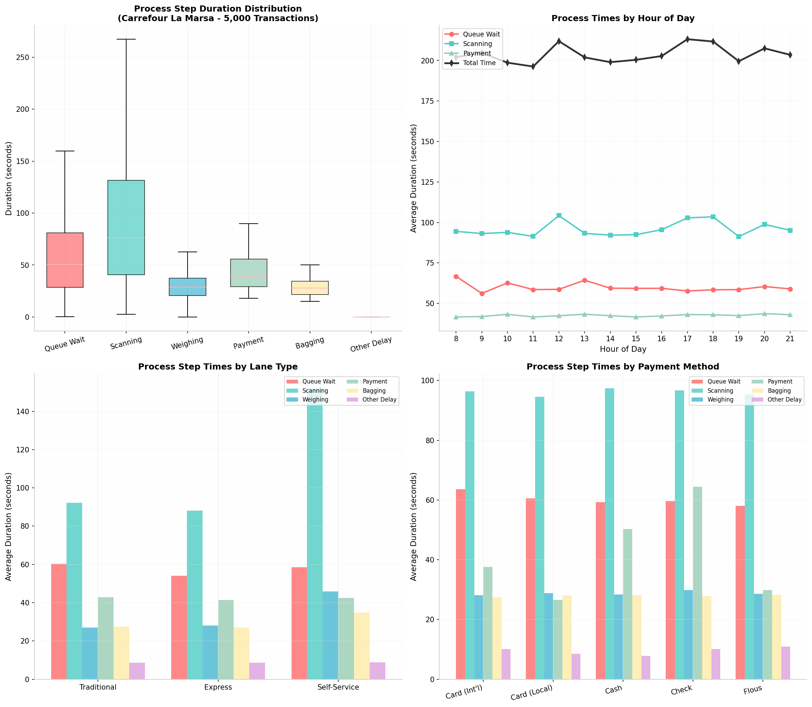
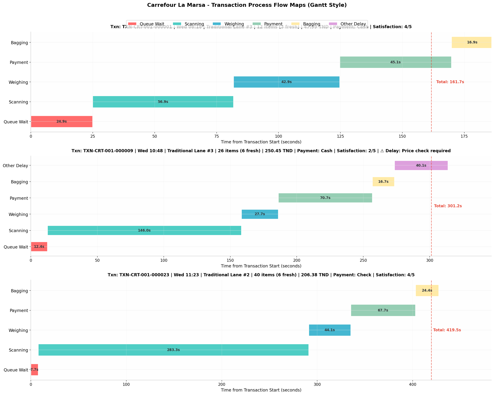
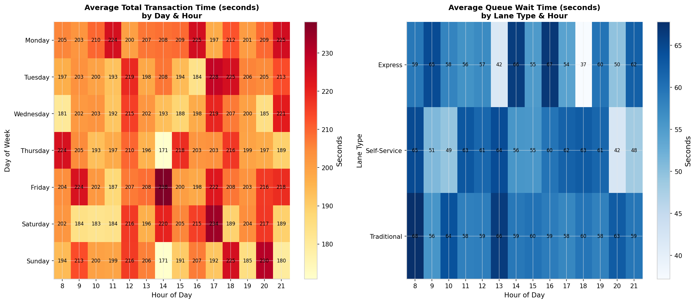
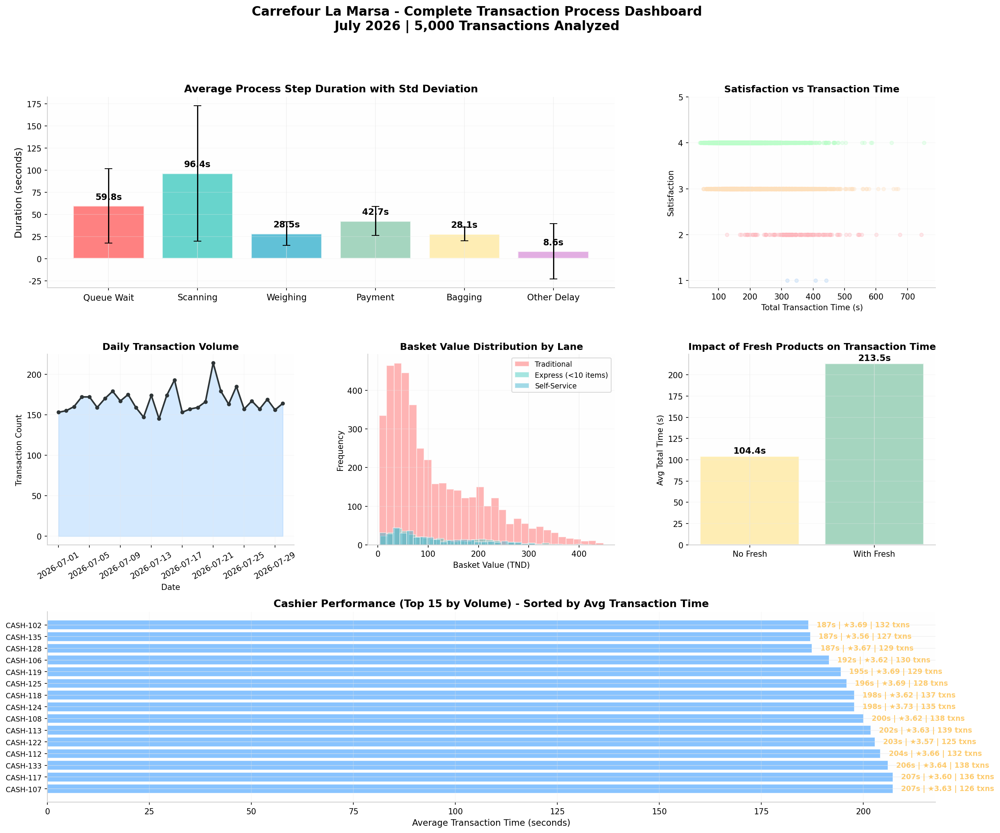

# Carrefour La Marsa — Checkout Process Mining

*Reconstructing 5,000 real supermarket checkouts, second by second, to find out where time — and customer patience — actually goes.*


## Table of Contents

- [Overview](#overview)
- [Results at a Glance](#results-at-a-glance)
- [Visualizations](#visualizations)
- [Dataset](#dataset)
- [Methodology](#methodology)
- [Key Findings](#key-findings)
- [Recommendations](#recommendations)
- [Repository Structure](#repository-structure)
- [Getting Started](#getting-started)
- [Tech Stack](#tech-stack)
- [Limitations and Data Notes](#limitations-and-data-notes)
- [Author](#author)
- [License](#license)

## Overview

A receipt tells you *what* a customer bought. It doesn't tell you *why* they waited three minutes in line, or *where* a seven-minute transaction lost its time. This project reconstructs that missing layer.

Starting from six raw duration fields per transaction — queue wait, scanning, weighing, payment, bagging, and "other" delays — a process-mapping engine chains them into a full, timestamped timeline for each of 5,000 checkout transactions recorded at a Carrefour hypermarket in La Marsa, Tunisia, over July 2026. The result is a second-by-second view of the checkout process that can be sliced by lane type, payment method, cashier, hour, and day: a flat transactions table turned into an operations-analytics dataset.

**Goal:** find out where the checkout process loses the most time, why, and what would actually move the needle — the kind of bottleneck-and-root-cause question industrial engineers ask about production or service lines, applied here to retail.

## Results at a Glance

| | |
|---|---|
| Transactions analyzed | 5,000 |
| Period | July 1–30, 2026 (30 days) |
| Checkout lanes / cashiers | 13 lanes across 3 lane types / 45 cashiers |
| Avg. checkout time | ~204s (median 185s) |
| Biggest single lever | **Scanning** — 47% of total time, and the most variable step by far |
| Slowest lane type | **Self-Service** — 284s vs. 198s (Traditional), driven almost entirely by scan time |
| Cheapest fix | **Payment method** — Cash (54% of transactions) takes ~2× longer than card |
| Satisfaction cliff | Ratings hold steady (~3.6–3.8) up to ~300s, then drop sharply (~3.1) beyond it |

## Visualizations

### 1. Where does time go? — Process step analysis



Scanning is both the longest step and the most variable — its spread is almost as wide as its mean. It barely moves by hour of day, but it swings sharply by lane type and payment method.

### 2. Three checkouts, three stories — Gantt-style transaction timelines



A clean 12-item transaction (161.7s) next to a 26-item transaction stalled by a 40-second price check (301.2s), and a 40-item basket where scanning alone eats 283 seconds (419.5s total). Large baskets and mid-transaction delays don't just cost their own time — they hold up everyone queued behind them.

### 3. When and where it hurts — Bottleneck heatmaps



Total transaction time by day and hour, and queue wait by lane type and hour. The slowest windows in the data are Friday 14:00 and Saturday 17:00 (~234–238s); Wednesday mornings and early Thursday/Sunday afternoons run calmest (~171–182s). Each day-hour cell averages only ~12 transactions, so read this as a directional pattern rather than a fixed rush hour.

### 4. The executive view — Complete dashboard



Six panels aimed at a store-management audience: step durations, satisfaction vs. time, daily volume, basket value by lane, the fresh-produce time penalty, and cashier performance.

### 5. Interactive walkthrough

An animated, scrollable HTML version of the process map — built as a standalone presentation piece — lives at [`interactive/htmlmapforfun.html`](interactive/htmlmapforfun.html). Open it directly in a browser, or publish it as a live page: copy it to `docs/index.html` and set **Settings → Pages → Source** to the `main` branch, `/docs` folder.

## Dataset

`data/01_transactions.csv` — 5,000 rows × 23 fields.

| Category | Fields |
|---|---|
| Transaction context | `transaction_id`, `timestamp`, `date`, `day_of_week`, `hour`, `is_weekend` |
| Lane and staff | `lane_type`, `lane_number`, `cashier_id` |
| Basket | `n_items`, `n_fresh_items`, `has_fresh_products`, `basket_value_tnd`, `payment_method` |
| Process step durations (sec) | `queue_wait_time_sec`, `scan_time_sec`, `weighing_time_sec`, `payment_time_sec`, `bagging_time_sec`, `other_delay_sec`, `delay_reason` |
| Outcome | `total_transaction_time_sec`, `customer_satisfaction` |

Baskets average 18.5 items (114 TND, median 80 TND); 91.6% include at least one fresh, weighed product. Cash is the dominant payment method (54.0% of transactions), followed by Card – Local (21.6%), Flous mobile payment (11.4%), Card – International (7.3%), and Check (5.7%).

## Methodology

The core of the analysis is `create_process_map()`, in [`notebook/Process_Map_For_transaction_csv.ipynb`](notebook/Process_Map_For_transaction_csv.ipynb). For each transaction it:

1. Starts a running clock at the transaction's `timestamp`.
2. Advances the clock through each step in sequence: **Queue Wait → Scanning → Weighing → Payment → Bagging → Other Delay**.
3. Skips Weighing when the basket has no fresh products, and skips Other Delay when nothing went wrong — so every transaction gets exactly the steps it actually went through.
4. Records each step's start and end time, both in absolute time and relative to transaction start (`step_start_relative_sec`, `step_end_relative_sec`).

Run across all 5,000 transactions, this turns the wide table (23 columns × 5,000 rows) into a long, event-level table — 24,990 rows, one per process step — exported as `carrefour_process_mapped_data.csv`. Long format is what most BI and process-mining tools (Tableau, Power BI, Celonis, Disco) expect: it lets you filter by step, animate flow, or align every transaction at t = 0 to compare shapes directly.

## Key Findings

**Scanning is the dominant bottleneck.** At 96.4s average (47% of total time), it's the longest step by a wide margin — and the least predictable, with a standard deviation (76.4s) nearly as large as its mean. A 40-item basket in the sample took 283 seconds on scanning alone.

**Self-Service lanes are the slowest, not the fastest.** Despite the "convenience" framing, Self-Service transactions average 284s — 43% slower than Traditional (198s) and 47% slower than Express (193s). The gap isn't queue wait (58.6s, actually slightly *below* Traditional's 60.3s) — it's scan time: 152s of self-scanning vs. 92s for a trained cashier. Self-Service also posts the lowest satisfaction (3.5 vs. 3.6–3.7 elsewhere), on just 7.5% of transaction volume.

**Payment method is a cheap, high-leverage fix.** Payment duration ranges from 26.5s (Card, local) to 64.4s (Check) — a 2.4× spread. Cash sits at 50.2s and is the single most common method (54% of all transactions), so the slowest common payment method is also the default one.

**Delays are rare but expensive.** 8.2% of transactions (412 of 5,000) hit an "other delay" — item returns, supervisor approvals, promo code issues, barcode failures, price checks, or terminal errors, each roughly equally likely — adding ~104 seconds when one occurs.

**Satisfaction holds, then falls off a cliff.** Ratings stay in a narrow 3.6–3.8 band for any transaction under 300 seconds (86% of the dataset), then drop to ~3.1 beyond it. The operational target isn't "as fast as possible" — it's "reliably under five minutes."

**Performance varies a lot by cashier.** Across 45 cashiers, the fastest handle transactions in the 170–190s range without sacrificing satisfaction; the slowest average over 210s. Among the busiest cashiers, the quickest (CASH-102, CASH-128, CASH-135) complete transactions in ~187s while holding satisfaction above 3.5.

## Recommendations

| Horizon | Action | Why |
|---|---|---|
| Quick win | Open all lanes by 07:45 instead of ramping up gradually | Cuts the early-morning queue spike |
| Quick win | Nudge customers toward card or mobile payment at checkout | Shifting Cash → Card saves up to ~24s per transaction, on 54% of volume |
| Quick win | Pre-weigh common fresh items (bananas, tomatoes) near the produce section | Removes ~30s for the 91.6% of baskets carrying fresh product |
| Quick win | Give cashiers authority for small price discrepancies | Cuts "price check" delays — one of six roughly equal delay causes |
| Medium-term | Match lane staffing to hourly demand instead of a flat schedule | Late-afternoon/evening windows run consistently slower |
| Medium-term | Enforce the Express-lane item limit | Traditional lanes handle 85% of volume; misrouted large baskets erode Express's advantage |
| Medium-term | Coach lower-performing cashiers using top performers' technique | ~50-second gap between fastest and slowest cashiers, at comparable satisfaction |
| Structural | Rethink Self-Service: hardware, UX, or a staffed "assisted self-service" model | Self-Service currently costs more time than it saves, on every metric that matters |
| Structural | Faster authorization for international cards | Second-slowest payment method after Check |

## Repository Structure

```
carrefour-checkout-process-mining/
├── README.md
├── data/
│   ├── 01_transactions.csv                   # raw dataset, 5,000 transactions
│   └── carrefour_process_mapped_data.csv     # generated by the notebook (long format)
├── notebook/
│   └── Process_Map_For_transaction_csv.ipynb # full analysis pipeline
├── visuals/
│   ├── carrefour_process_analysis.png
│   ├── carrefour_gantt_process_map.png
│   ├── carrefour_heatmap_bottlenecks.png
│   └── carrefour_complete_dashboard.png
└── interactive/
    └── htmlmapforfun.html                     # standalone animated process-map page
```

> This layout is a suggestion. If everything sits at the repo root instead, just drop the folder prefixes from the image and link paths above.

## Getting Started

The notebook was built for Google Colab (it opens with a `files.upload()` cell) but runs the same locally.

**Option A — Google Colab:** open the notebook, upload `01_transactions.csv` when prompted, run all cells.

**Option B — Local:**

```bash
git clone <your-repo-url>
cd <repo-folder-name>
pip install pandas numpy matplotlib seaborn jupyter
jupyter notebook notebook/Process_Map_For_transaction_csv.ipynb
```

Replace the Colab upload cell with a direct `pd.read_csv('../data/01_transactions.csv')` if running locally. Re-running the notebook regenerates all four charts and `carrefour_process_mapped_data.csv`.

## Tech Stack

- **Python** — pandas, NumPy for data wrangling
- **Matplotlib**, **Seaborn** — static visualizations
- **Jupyter / Google Colab** — analysis environment
- **HTML / CSS** — standalone interactive process-map page

## Limitations and Data Notes

- **Single store, single month.** Findings describe Carrefour La Marsa in July 2026 and may not generalize to other locations or seasons.
- **Correlation, not causation.** The link between speed and satisfaction is observational — confirming it would take an A/B test (e.g., staffing changes on matched days).
- **`total_transaction_time_sec` is its own field, not the row-wise sum of the six step columns** (the six parts average ~264s combined vs. ~204s for the total, on the same rows) — most likely an artifact of how the dataset was generated. Step-level comparisons (by lane, payment, hour) aren't affected; just don't treat the total as a strict sum of the parts.
- **376 transactions (7.5%) have a missing `cashier_id`** — worth checking at the source before using that field for anything cashier-specific.
- **Day-hour heatmap cells are small samples** (~12 transactions each), so treat specific cells as directional rather than exact.
- **No cost data**, so the recommendations above are ranked by plausible time-impact, not verified ROI.

## Author

**Mayssa Saidi** — Industrial Engineering student @ ENIT 
MS Industrialsolutions  Case Study ###001


## License

 MIT LICENSE
